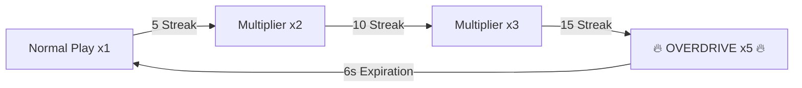
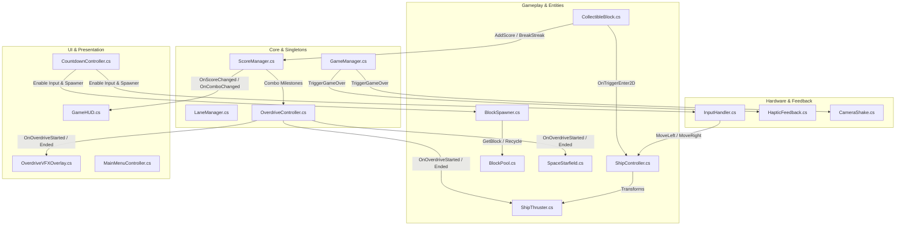

# 🎮 True Colors

<div align="center">


<p align="center">
  <b>A high-octane, split-brain dual-runner arcade game built for high-refresh mobile and desktop platforms in Unity 6.</b>
</p>

</div>

---

## 📖 Table of Contents

- [Overview](#-overview)
- [Gameplay Mechanics](#-gameplay-mechanics)
  - [Split-Screen Coordination & Responsive Lanes](#split-screen-coordination--responsive-lanes)
  - [Color Matrix & Hazard Rules](#color-matrix--hazard-rules)
  - [Streak Multipliers & Overdrive Mode](#streak-multipliers--overdrive-mode)
  - [Fail Conditions](#fail-conditions)
- [Visual FX & Atmospheric Systems](#-visual-fx--atmospheric-systems)
  - [Reactive Ship Thruster Propulsion (`ShipThruster`)](#reactive-ship-thruster-propulsion-shipthruster)
  - [Subtle Pure-White Cosmic Starfield (`SpaceStarfield`)](#subtle-pure-white-cosmic-starfield-spacestarfield)
  - [Overdrive Visual State Overlay (`OverdriveVFXOverlay`)](#overdrive-visual-state-overlay-overdrivevfxoverlay)
- [Software Architecture & Systems](#-software-architecture--systems)
  - [Architectural Runtime Flow](#architectural-runtime-flow)
  - [Component Architecture](#component-architecture)
  - [Zero-Allocation Object Pooling (`BlockPool`)](#zero-allocation-object-pooling-blockpool)
  - [Dynamic Difficulty Scaling (`BlockSpawner`)](#dynamic-difficulty-scaling-blockspawner)
  - [Multi-Touch & Spatial Input Handling (`InputHandler`)](#multi-touch--spatial-input-handling-inputhandler)
  - [Native Android JNI & iOS Haptics (`HapticFeedback`)](#native-android-jni--ios-haptics-hapticfeedback)
  - [Unscaled Procedural Camera Shake (`CameraShake`)](#unscaled-procedural-camera-shake-camerashake)
- [Project Structure & Asset Organization](#-project-structure--asset-organization)
- [Controls](#-controls)
  - [Mobile Touch Zones](#mobile-touch-zones)
  - [Desktop / Editor Keybindings](#desktop--editor-keybindings)
- [Prerequisites & Getting Started](#-prerequisites--getting-started)
  - [Engine Requirements](#engine-requirements)
  - [Installation & Quickstart Setup](#installation--quickstart-setup)
- [Build & Deployment Pipeline](#-build--deployment-pipeline)
  - [iOS Build Setup](#ios-build-setup)
  - [Android Build Setup](#android-build-setup)
- [Performance & Architectural Highlights](#-performance--architectural-highlights)
- [Authorship & Credits](#-authorship--credits)

---

## 🕹️ Overview

**True Colors** challenges the player's bilateral cognitive processing and reflex precision. Players simultaneously pilot two independent starships situated across partitioned left and right highway sectors:
- **Left Ship (Red Vessel)** defends the left sector from falling color blocks.
- **Right Ship (Blue Vessel)** defends the right sector from falling color blocks.

Players must filter matching target colors while dodging mismatched hazards, stringing together uninterrupted combos to unlock a hyper-speed **Overdrive Mode** that transmutes hazardous blocks into scoring opportunities.

Designed with mobile-first performance principles, True Colors runs with an ultra-lightweight CPU overhead, zero garbage collection pauses during active gameplay, procedural lightweight visual effects, and native hardware vibration response.

---

## ⚡ Gameplay Mechanics

### Split-Screen Coordination & Responsive Lanes

The game field is divided vertically into two symmetric arenas, each containing **3 discrete lanes** (6 parallel tracks in total) dynamically calculated by [`LaneManager`](file:///Users/diegovilla/Desktop/unity/TrueColors/Assets/Scripts/Gameplay/LaneManager.cs) based on camera orthographic projection and screen aspect ratio:

```
       LEFT SECTOR (RED SHIP)        |       RIGHT SECTOR (BLUE SHIP)
 Lane -2.1    Lane -1.4    Lane -0.7 | Lane +0.7    Lane +1.4    Lane +2.1
   [ | ]        [ | ]        [ | ]   |   [ | ]        [ | ]        [ | ]
     │            │            │     |     │            │            │
     ▼            ▼            ▼     |     ▼            ▼            ▼
 ────────────────────────────────────┼────────────────────────────────────
            [ 🚀 Left Ship ]         |           [ 🚀 Right Ship ]
```

Smooth lane changes are governed by interpolation damping (`Vector3.Lerp` at `15f` units/sec), providing punchy, responsive feedback without instantaneous jarring teleportation.

### Color Matrix & Hazard Rules

Blocks spawn from the top boundary (`Y = 6.0`) and cascade downward. Each sector features customized color-matching rules:

| Sector | Player Ship | Valid Target Color | Obstacle Colors | Penalty for Obstacle Contact |
| :--- | :--- | :--- | :--- | :--- |
| **Left Arena** (`X < 0`) | **Red Ship** | 🔴 **Red** (`#FF3333`) | 🔵 Blue, 🟡 Yellow, 🟢 Green | **Immediate Game Over** |
| **Right Arena** (`X > 0`) | **Blue Ship** | 🔵 **Blue** (`#3380FF`) | 🔴 Red, 🟡 Yellow, 🟢 Green | **Immediate Game Over** |

### Streak Multipliers & Overdrive Mode

Successive successful color catches increment the combo counter managed by [`ScoreManager`](file:///Users/diegovilla/Desktop/unity/TrueColors/Assets/Scripts/Score/ScoreManager.cs) and [`OverdriveController`](file:///Users/diegovilla/Desktop/unity/TrueColors/Assets/Scripts/Gameplay/OverdriveController.cs), progressively boosting score accumulation:



- **Streak < 5:** `1x` Point Multiplier (`+10` pts per catch).
- **Streak 5 - 9:** `2x` Point Multiplier (`+20` pts per catch).
- **Streak 10 - 14:** `3x` Point Multiplier (`+30` pts per catch).
- **Streak ≥ 15 → OVERDRIVE ACTIVATION (6 Seconds Duration):**
  - **`5x` Multiplier:** Massive score inflation (`+50` pts per catch).
  - **Invulnerability:** Player is completely immune to collision game overs.
  - **Dynamic Board Transmutation:** All currently falling hazard blocks in both sectors instantly re-skin their colors to match the target vessels.
  - **100% Target Spawn Bias:** Every block generated by the spawner during Overdrive is guaranteed to match the sector's ship.
  - **Visual Warp & Afterburners:** Starfield accelerates into warp streaks, thruster plumes expand, and camera chromatic vignette pulses.

### Fail Conditions

1. **Hazard Collision:** Catching a block that does not match the active vessel's `targetColor`.
2. **Target Miss:** Allowing a target block (Red on Left or Blue on Right) to fall past the bottom threshold (`Y < -5.5`). Missed obstacles do not penalize the player.

---

## 🌌 Visual FX & Atmospheric Systems

### Reactive Ship Thruster Propulsion (`ShipThruster`)

The [`ShipThruster`](file:///Users/diegovilla/Desktop/unity/TrueColors/Assets/Scripts/Gameplay/ShipThruster.cs) system equips each vessel with an animated flame plume positioned beneath the ship's engine exhaust:
- **Procedural Sinusoidal Flicker:** Scales width (`X`) and length (`Y`) using multi-frequency sine oscillators, creating an organic fiery pulse without heavy sprite flipbooks.
- **Overdrive Afterburner:** When Overdrive triggers, the plume scales up to `1.8x` in length and intensity.
- **Strict Sorting Order:** Rendered at `SortingOrder: 1` (positioned in front of the background and behind ship hulls at `SortingOrder: 2`).

### Subtle Pure-White Cosmic Starfield (`SpaceStarfield`)

The [`SpaceStarfield`](file:///Users/diegovilla/Desktop/unity/TrueColors/Assets/Scripts/Gameplay/SpaceStarfield.cs) generates a background space atmosphere with strict non-invasive constraints:
- **Strict Pure-White Hue:** All particles exclusively use `Color.white` with varying soft alpha (`0.12` to `0.38`), eliminating any visual ambiguity with red, blue, green, or yellow blocks.
- **Procedural Smooth Texture:** Employs a runtime-generated 32x32 radial smoothstep particle texture, avoiding blocky square artifacts.
- **Background Depth (`SortingOrder: -10`):** Guaranteed to render underneath all gameplay elements (blocks, lane dividers, thrusters, and ships).
- **Dynamic Warp Speed:** Accelerates particle simulation speed from `1.4f` to `4.2f` and engages stretch scaling (`lengthScale` up to `2.4x`) during Overdrive mode.

### Overdrive Visual State Overlay (`OverdriveVFXOverlay`)

The [`OverdriveVFXOverlay`](file:///Users/diegovilla/Desktop/unity/TrueColors/Assets/Scripts/UI/OverdriveVFXOverlay.cs) provides a full-screen peripheral golden pulse and camera lens vignette while Overdrive is active, delivering immediate cognitive feedback without obscuring falling blocks.

---

## 🏗️ Software Architecture & Systems

True Colors is engineered following clean code and SOLID architectural patterns in C#, emphasizing modularity, thin controllers, and decoupled event channels.

### Architectural Runtime Flow



### Component Architecture

| Script | Location | Responsibility |
| :--- | :--- | :--- |
| [`GameManager.cs`](file:///Users/diegovilla/Desktop/unity/TrueColors/Assets/Scripts/Core/GameManager.cs) | `Core/` | Central state machine orchestrating game flow (Playing, Paused, GameOver), restart flows, and modular auto-wiring. |
| [`ScoreManager.cs`](file:///Users/diegovilla/Desktop/unity/TrueColors/Assets/Scripts/Score/ScoreManager.cs) | `Score/` | Manages score points, combo streaks, multipliers, and persistent high scores via `PlayerPrefs`. |
| [`OverdriveController.cs`](file:///Users/diegovilla/Desktop/unity/TrueColors/Assets/Scripts/Gameplay/OverdriveController.cs) | `Gameplay/` | Governs the 6-second invulnerable Overdrive timer, block transmutation events, and visual state dispatching. |
| [`LaneManager.cs`](file:///Users/diegovilla/Desktop/unity/TrueColors/Assets/Scripts/Gameplay/LaneManager.cs) | `Gameplay/` | Computes responsive lane world coordinates dynamically adapted to any device aspect ratio. |
| [`ShipController.cs`](file:///Users/diegovilla/Desktop/unity/TrueColors/Assets/Scripts/Gameplay/ShipController.cs) | `Gameplay/` | Controls 3-lane ship movement, bounds clamping, and smooth interpolation damping. |
| [`ShipThruster.cs`](file:///Users/diegovilla/Desktop/unity/TrueColors/Assets/Scripts/Gameplay/ShipThruster.cs) | `Gameplay/` | Manages engine exhaust sprites, sinusoidal flicker animations, and afterburner expansion during boost. |
| [`SpaceStarfield.cs`](file:///Users/diegovilla/Desktop/unity/TrueColors/Assets/Scripts/Gameplay/SpaceStarfield.cs) | `Gameplay/` | Generates pure-white cosmic background micro-stars with twinkle and warp-speed stretch effects. |
| [`CollectibleBlock.cs`](file:///Users/diegovilla/Desktop/unity/TrueColors/Assets/Scripts/Gameplay/CollectibleBlock.cs) | `Gameplay/` | Translates downward, handles trigger collisions, particle bursts, and pool return lifecycle. |
| [`BlockPool.cs`](file:///Users/diegovilla/Desktop/unity/TrueColors/Assets/Scripts/Gameplay/BlockPool.cs) | `Gameplay/` | High-performance zero-allocation object pool managing block recycling via `Queue<GameObject>`. |
| [`BlockSpawner.cs`](file:///Users/diegovilla/Desktop/unity/TrueColors/Assets/Scripts/Gameplay/BlockSpawner.cs) | `Gameplay/` | Procedural difficulty director scaling spawn frequency and velocity across a 60-second ramp curve. |
| [`InputHandler.cs`](file:///Users/diegovilla/Desktop/unity/TrueColors/Assets/Scripts/Input/InputHandler.cs) | `Input/` | Decouples EnhancedTouch screen quadrants and keyboard arrows into discrete ship lane shifts. |
| [`GameHUD.cs`](file:///Users/diegovilla/Desktop/unity/TrueColors/Assets/Scripts/UI/GameHUD.cs) | `UI/` | Updates in-game UI (score, combo, high score, game over modal, pause panel) via reactive events. |
| [`OverdriveVFXOverlay.cs`](file:///Users/diegovilla/Desktop/unity/TrueColors/Assets/Scripts/UI/OverdriveVFXOverlay.cs) | `UI/` | Renders a pulsating golden edge vignette during active Overdrive mode. |
| [`CountdownController.cs`](file:///Users/diegovilla/Desktop/unity/TrueColors/Assets/Scripts/UI/CountdownController.cs) | `UI/` | Coordinates the opening `3-2-1-GO!` countdown, unlocking player input and spawner upon match start. |
| [`MainMenuController.cs`](file:///Users/diegovilla/Desktop/unity/TrueColors/Assets/Scripts/UI/MainMenuController.cs) | `UI/` | Handles main menu scene transitions, high score displays, and frame-rate lock initialization. |
| [`HapticFeedback.cs`](file:///Users/diegovilla/Desktop/unity/TrueColors/Assets/Scripts/Feedback/HapticFeedback.cs) | `Feedback/` | Low-latency bridge executing native Android JNI `VibrationEffect` and iOS `Handheld.Vibrate()`. |
| [`CameraShake.cs`](file:///Users/diegovilla/Desktop/unity/TrueColors/Assets/Scripts/Feedback/CameraShake.cs) | `Feedback/` | Procedural camera shake operating on unscaled time, active even when `Time.timeScale = 0`. |

### Zero-Allocation Object Pooling (`BlockPool`)

Spawning and destroying hundreds of falling blocks per minute creates severe garbage collection pressure on mobile CPUs. `BlockPool` prewarms instances on `Awake()`:

```csharp
public GameObject GetBlock()
{
    GameObject block = pool.Count > 0 ? pool.Dequeue() : Instantiate(blockPrefab, transform);
    block.SetActive(true);
    return block;
}

public void ReturnBlock(GameObject block)
{
    block.SetActive(false);
    pool.Enqueue(block);
}
```

### Dynamic Difficulty Scaling (`BlockSpawner`)

The difficulty ramp interpolates both spawn interval and vertical velocity over a configurable ramp window (`difficultyRampTime = 60s`):

$$\text{Progress} = \text{clamp}_0^1\left(\frac{t_{\text{elapsed}}}{60.0}\right)$$

- **Spawn Rate:** Interpolates linearly from `1.10s` down to `0.45s`.
- **Block Velocity:** Accelerates linearly from `4.5` units/sec up to `10.0` units/sec.
- **Color Distribution:** 50% probability to spawn the sector's matching target color; 50% distributed among hazardous colors.

### Multi-Touch & Spatial Input Handling (`InputHandler`)

Utilizing Unity's New Input System with `EnhancedTouchSupport`, the screen is partitioned into four dynamic touch quadrants:

```
┌───────────────────────────────┬───────────────────────────────┐
│        LEFT SECTOR (X < 50%)  │       RIGHT SECTOR (X >= 50%) │
│  [ Left Ship: Move Left ]     │  [ Right Ship: Move Left ]    │
│  Touch: 0% - 25% Screen Width │  Touch: 50% - 75% Screen Width│
│───────────────────────────────┼───────────────────────────────┤
│  [ Left Ship: Move Right ]    │  [ Right Ship: Move Right ]   │
│  Touch: 25% - 50% Screen Width│  Touch: 75% - 100% Screen Width│
└───────────────────────────────┴───────────────────────────────┘
```

### Native Android JNI & iOS Haptics (`HapticFeedback`)

To avoid standard latency in mobile feedback, True Colors leverages Android JNI directly via `AndroidJavaClass` to access `android.os.VibrationEffect`:
- **Android API ≥ 26:** Invokes `VibrationEffect.createOneShot(45L, -1)` targeting the native vibration hardware layer.
- **Android API < 26:** Falls back to `vibrator.Call("vibrate", 45L)`.
- **iOS:** Dispatches tactile impulses via `Handheld.Vibrate()`.

### Unscaled Procedural Camera Shake (`CameraShake`)

When a game-ending impact occurs, the simulation freezes via `Time.timeScale = 0f`. `CameraShake` samples `Time.unscaledDeltaTime`, delivering full visual punch even while game physics are suspended.

---

## 📁 Project Structure & Asset Organization

```
TrueColors/
├── Assets/
│   ├── Art/
│   │   └── Sprites/
│   │       ├── Environment/        # Space backgrounds and celestial assets
│   │       ├── Rocks/              # Collectible rock sprites (Red, Blue, Yellow, Green, Bomb, Time)
│   │       ├── Starship/           # Dual player starship hull sprites
│   │       └── Thruster/           # Animated rocket thruster plumes (thruster_flame.png)
│   ├── Materials/                  # URP Materials & Trail renderers
│   ├── Prefabs/                    # Configured Game Entities
│   │   ├── Block.prefab            # CollectibleBlock entity with BoxCollider2D & SpriteRenderer
│   │   └── CollectParticles.prefab # Particle burst VFX matching target color
│   ├── Scenes/
│   │   ├── MainMenu.unity          # Entry scene (Play, Options, High Score display)
│   │   └── MainGame.unity          # Core gameplay arena, Ships, Spawner, UGUI Canvas
│   ├── Scripts/                    # Modular C# Feature-First Architecture
│   │   ├── Core/                   # Central state orchestrator (GameManager.cs)
│   │   ├── Feedback/               # HapticFeedback.cs, CameraShake.cs
│   │   ├── Gameplay/               # Ships, Thrusters, Starfield, Blocks, Spawner, Pools, Lanes
│   │   ├── Input/                  # InputHandler.cs (EnhancedTouch & Keyboard)
│   │   ├── Score/                  # ScoreManager.cs (Combos, Points, High Scores)
│   │   └── UI/                     # GameHUD.cs, OverdriveVFXOverlay.cs, Menus, Countdowns
│   ├── Settings/                   # URP pipeline assets & quality profiles
│   └── TextMesh Pro/               # Font assets, glyph tables & material presets
├── Packages/
│   └── manifest.json               # Package dependencies (URP, InputSystem, TextMeshPro)
├── ProjectSettings/                # Build profiles, physics layers, graphics settings
└── dist/                           # Native Xcode iOS export project (IL2CPP)
```

---

## 🎮 Controls

### Mobile Touch Zones

Tap anywhere in the corresponding screen region to shift lanes:

| Screen Region | Target Ship | Action |
| :--- | :--- | :--- |
| **0% – 25% Width** (Far Left) | 🔴 **Left Ship** | Shift 1 Lane Left |
| **25% – 50% Width** (Mid Left) | 🔴 **Left Ship** | Shift 1 Lane Right |
| **50% – 75% Width** (Mid Right) | 🔵 **Right Ship** | Shift 1 Lane Left |
| **75% – 100% Width** (Far Right) | 🔵 **Right Ship** | Shift 1 Lane Right |

### Desktop / Editor Keybindings

For desktop testing and Unity Editor development:

| Key | Ship | Direction |
| :---: | :---: | :---: |
| <kbd>A</kbd> | 🔴 Left Ship | Move Left |
| <kbd>D</kbd> | 🔴 Left Ship | Move Right |
| <kbd>←</kbd> | 🔵 Right Ship | Move Left |
| <kbd>→</kbd> | 🔵 Right Ship | Move Right |

---

## 🚀 Prerequisites & Getting Started

### Engine Requirements

- **Unity Editor:** `6000.6.0f1` (Unity 6 LTS) or compatible 6000.x stream.
- **Render Pipeline:** Universal Render Pipeline (URP) `17.6.0+`.
- **Input System:** Unity New Input System `1.20.0+`.
- **Target OS:** iOS 14.0+, Android 8.0+ (API Level 26+), macOS, Windows.

### Installation & Quickstart Setup

1. **Clone the Repository:**
   ```bash
   git clone https://github.com/DiegoVilla27/true-colors-unity.git
   cd true-colors-unity
   ```

2. **Open Project in Unity Hub:**
   - Launch **Unity Hub**.
   - Click **Add** -> **Add project from disk**.
   - Select the repository root directory.
   - Verify the Editor Version is set to **Unity 6 (6000.6.0f1)**.

3. **Resolve Package Dependencies:**
   - Open the project and allow the Unity Package Manager (UPM) to restore all packages listed in `Packages/manifest.json`.

4. **Launch the Game in Play Mode:**
   - In the **Project** tab, open `Assets/Scenes/`.
   - Double-click [`MainMenu.unity`](file:///Users/diegovilla/Desktop/unity/TrueColors/Assets/Scenes/MainMenu.unity) (or [`MainGame.unity`](file:///Users/diegovilla/Desktop/unity/TrueColors/Assets/Scenes/MainGame.unity) for direct gameplay testing).
   - Press the **Play** button at the top of the Unity Editor.
   - Use <kbd>A</kbd>/<kbd>D</kbd> and <kbd>←</kbd>/<kbd>→</kbd> to control both ships simultaneously.

---

## 📦 Build & Deployment Pipeline

### iOS Build Setup

1. In Unity, select **File** -> **Build Profiles** (or **Build Settings**).
2. Switch Platform to **iOS**.
3. Ensure the scene build order is:
   - Index 0: `Assets/Scenes/MainMenu.unity`
   - Index 1: `Assets/Scenes/MainGame.unity`
4. Set **Scripting Backend** to `IL2CPP` and **Target Architecture** to `ARM64`.
5. Click **Build** and choose an export destination folder.
6. Open the generated `Unity-iPhone.xcworkspace` in Xcode, configure your **Signing & Capabilities** team profile, and deploy to your physical iOS device.

### Android Build Setup

1. Switch Platform to **Android** in **Build Settings**.
2. Set **Scripting Backend** to `IL2CPP` and enable `ARM64` in **Player Settings** -> **Other Settings**.
3. Minimum API Level: **Android 8.0 'Oreo' (API Level 26)** (ensures native `VibrationEffect` hardware support).
4. Target API Level: **Automatic / Highest Installed** (API 34+ recommended).
5. Build format: `.aab` (Android App Bundle) for Google Play release or `.apk` for local testing.

---

## 📈 Performance & Architectural Highlights

- **⚡ Zero-Allocation Game Loop:** All falling block entities are re-routed through `BlockPool`, producing zero garbage collection allocations (`0B GC.Alloc`) during high-density spawn phases.
- **📱 Fluid 60 FPS Target:** Frame rate is locked to 60 FPS (`Application.targetFrameRate = 60`) with `QualitySettings.vSyncCount = 0` to preserve battery life and thermal stability on mobile devices.
- **🛡️ State Resilient Singletons:** Core managers (`GameManager`, `ScoreManager`, `OverdriveController`, `BlockPool`, `CameraShake`) implement strict singleton validation preventing duplicate instances across scene reloads.
- **✨ Procedural Particle Shaders:** The background starfield employs runtime-generated smoothstep textures and built-in sprite unlit shaders, avoiding heavy texture assets and ensuring maximum GPU fill-rate efficiency.
- **🔊 Hardware-Accelerated Haptics:** Direct JNI invocation bypasses high-level wrappers for ultra-low latency physical tactile feedback.

---

## ✒️ Authorship & Credits

> This digital ecosystem has been designed, structured, and developed to high-performance standards by **[Cabuweb](https://cabuweb.com)** - **Software Developer: Diego Villa**.
